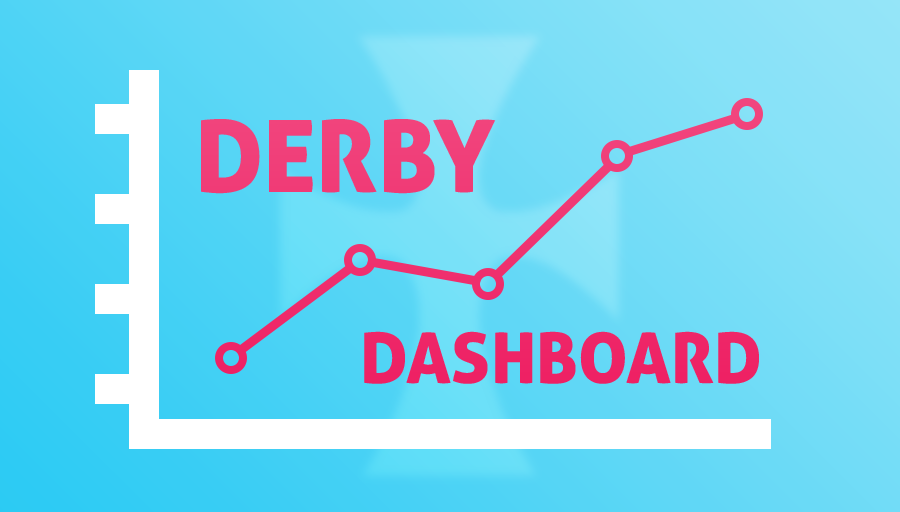

# Derby Dashboard

A web app that displays fundraising data, along with schedules and challenges.
[Live Website](https://derby-dashboard.herokuapp.com)



## Table of Contents

- [Prerequisites](#prerequisites)
- [Installation](#installation)
- [Usage](#usage)
- [Resources](#resources)
- [Contributing](#contributing)

## Prerequisites

You will need to Download and Install [Node.js](https://nodejs.org/en/download/) v6.x.x or greater

## Installation

Download or clone this project
```bash
git clone https://github.com/benz2012/derby-dashboard.git
```

Move into the project folder
```bash
cd derby-dashboard
```

Install all the Javascript libraries used to build this web application
```bash
npm install
```

## Usage

#### Development

Run the Node/Express server in development mode
```bash
npm run dev
```

Open a web browser and navigate to [localhost:8080](http://localhost:8080)

#### Production

Bundle & Build the web application using *Webpack*
```bash
npm run build
```

Run the Node/Express server in production mode
```bash
npm start
```

#### Worker Process

The worker process both scrapes/parses information from the web, and writes that information to an AWS DynamoDB.

You will need to request an `AWS_ACCESS_KEY_ID` and `AWS_SECRET_ACCESS_KEY` from the project maintainers.

Crate an environment variable file in the project root
```bash
touch env.js
```

Then Add the following lines to `env.js`
```javascript
process.env.AWS_ACCESS_KEY_ID = 'YOURKEY'
process.env.AWS_SECRET_ACCESS_KEY = 'YOURSECRETKEY'

```

Finally, run the process
```bash
node worker
```

#### Additional

Lint the Javascript source
```bash
npm run lint
```

## Resources

##### Major Libraries Used
- Express
- React
- Styled Components
- Webpack with Babel
- AWS SDK
- Cheerio

##### Maintainers
- [benz2012](https://github.com/benz2012)

## Contributing

Please contribute using [Github Flow](https://guides.github.com/introduction/flow/). Create a branch, add commits, and [open a pull request](https://github.com/benz2012/derby-dashboard/compare).
